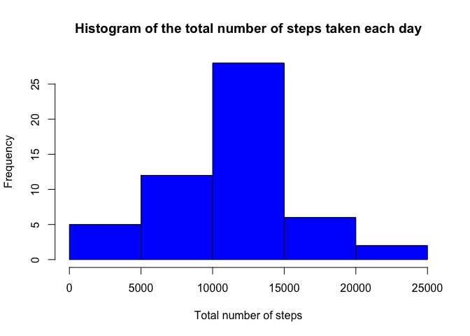
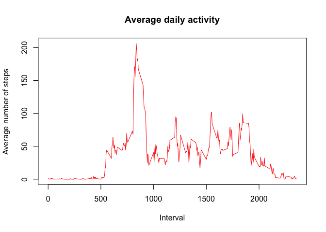
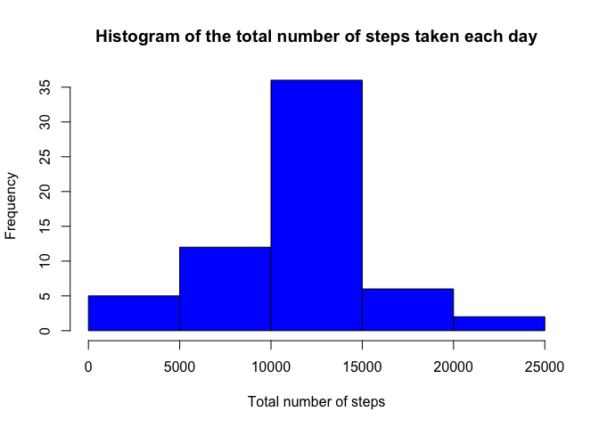
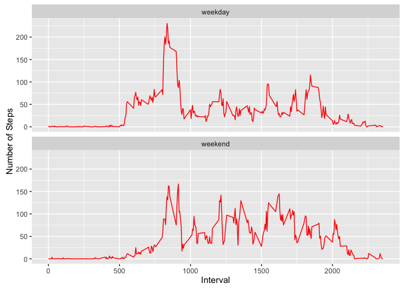

# Reproducible Research: Peer Assessment 1
## Loading packages

```r
library(knitr)
library(dplyr)
library(ggplot2)
opts_chunk$set(echo = TRUE)
```

**=================================================================================**

## Loading and preprocessing the data


```r
# data0 contains all data
# data is restricted to all the rows of data without NA
# date column is recast as class Date
data0 <- read.table("activity.csv", sep=",", header = TRUE)
data0$date <- as.Date(strptime(x = as.character(data0$date), format = "%Y-%m-%d"))
data <- data0[complete.cases(data0),]
```

**=================================================================================**

## What is mean total number of steps taken per day?

First, find the total number of steps taken for each day and plot the histogram of this result. Use the restricted data (without NAs).


```r
total <- tapply(data$steps, data$date, sum)
hist(total, 
     col = "blue",
     xlab = "Total number of steps",
     main = "Histogram of the total number of steps taken each day")
```

<!-- -->

Then find the mean and the median total number of steps per day:


```r
mean(total, na.rm = TRUE)
```

```
## [1] 10766.19
```

```r
median(total, na.rm = TRUE)
```

```
## [1] 10765
```
**The mean total number of steps per day is 10766.19 and the median is 10765.**

**=================================================================================**

## What is the average daily activity pattern?

Determine the the average number of steps taken for each time interval, averaged across all days and graph the result against time interval in a times series plot. Use the restricted data (without NAs).


```r
meanByInterval <- aggregate(steps ~ interval, data, mean)

plot(meanByInterval$interval, meanByInterval$steps, 
     type = 'l',
     col = 'red',
     xlab = "Interval",
     ylab = "Average number of steps",
     main = "Average daily activity")
```

<!-- -->

Now compute which 5-minute interval, on average across all the days in the dataset,
contains the maximum number of steps:


```r
meanByInterval[which.max(meanByInterval$steps),1]
```

```
## [1] 835
```

**The 5-minute interval that contains the maximum number of steps, averaged across all the days in the dataset, is 835 .**

**=================================================================================**

## Imputing missing values

Calculate and report the total number of missing values in the dataset


```r
sum(is.na(data0))
```

```
## [1] 2304
```

**The total number of missing values in the dataset is 2304.**

Impute the missing values using average number of steps taken for each time interval, averaged across all days, as computed above.


```r
dataImputed <- data0
iNA <- which(is.na(data0)) #Indices of rows containing na.
for (i in iNA) {
  currentInterval <- data0$interval[i] # value of interval with steps = NA
  icurrentInterval <- which(meanByInterval$interval==currentInterval) 
  dataImputed$steps[i] <- meanByInterval$steps[icurrentInterval]
}
```

With the imputed data, find the total number of steps taken for each day and plot the histogram of this result.


```r
totalImputed <- tapply(dataImputed$steps, dataImputed$date, sum)
hist(totalImputed, 
     col = "blue",
     xlab = "Total number of steps",
     main = "Histogram of the total number of steps taken each day")
```

<!-- -->

Do the means and medians of the restricted and imputed data differ?


```r
results = data.frame(c(mean(total, na.rm = TRUE), mean(totalImputed)),
                     c(median(total, na.rm = TRUE), median(totalImputed)))
colnames(results) <- c("mean", "median")
rownames(results) <- c("restriced data", "imputed data")
results
```

```
##                    mean   median
## restriced data 10766.19 10765.00
## imputed data   10766.19 10766.19
```

**Thus, the means of the restricted data and the imputed data is the same, while the medians of the imputed data is slightly higher than that of the restricted data.**

**=================================================================================**

## Are there differences in activity patterns between weekdays and weekends?

Create a new factor variable in the dataset with two levels – “weekday”
and “weekend” indicating whether a given date is a weekday or weekend
day.


```r
weekend = c("Saturday", "Sunday")
dataImputed$dayType <- weekdays(as.Date(dataImputed$date))
dataImputed$dayType[dataImputed$dayType %in% weekend ] <- "weekend"
dataImputed$dayType[dataImputed$dayType != "weekend"] <- "weekday"
dataImputed$dayType <- factor(dataImputed$dayType)
```

Make a panel plot containing a time series plot of the 5-minute interval and the average number of steps taken, averaged across all weekday days or weekend days. Use the imputed data.


```r
meanByIntDayType <- aggregate(steps ~ interval + dayType, dataImputed, mean)

g <- ggplot(meanByIntDayType, aes(interval, steps))

g + geom_line(color = "red") + 
  facet_wrap( ~ dayType, ncol = 1) +
  labs(x="Interval", y="Number of Steps")
```

<!-- -->

